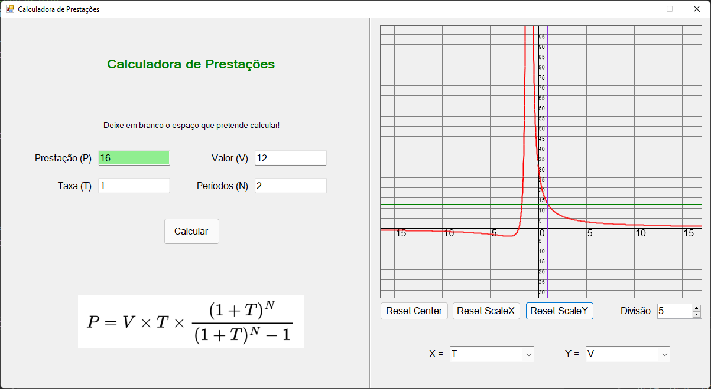
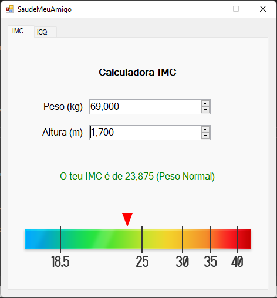
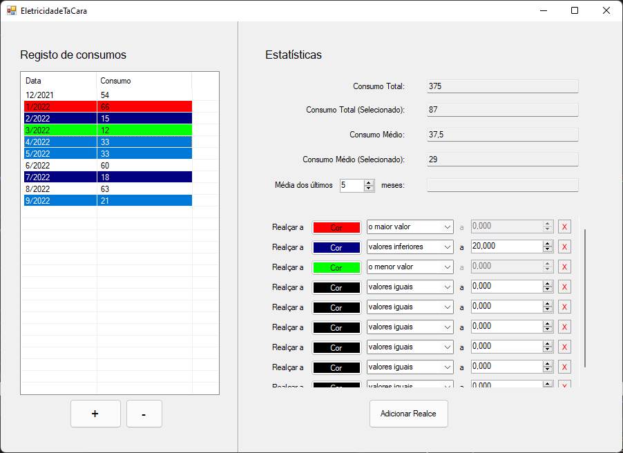
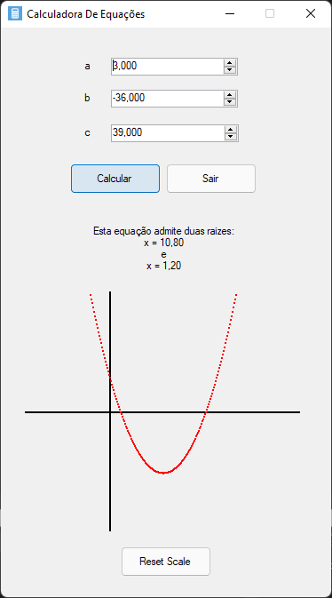

# ExerciciosAPI
Tornando os exercícios de API mais úteis desde 2021

## Screenshots

❤️ Especiais agradecimentos aos meus colegas de carteira, [Darguima](https://github.com/darguima) (Dário Guimarães) e [Afonso Pedreira](https://github.com/afooonso).

